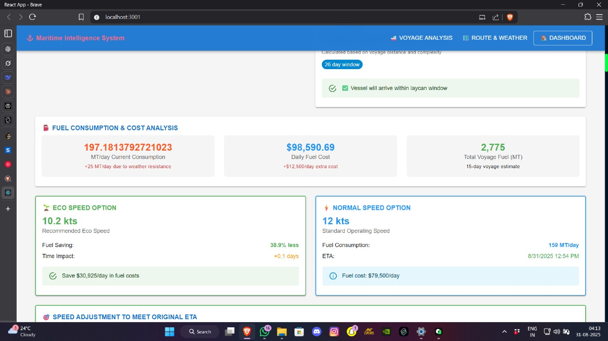
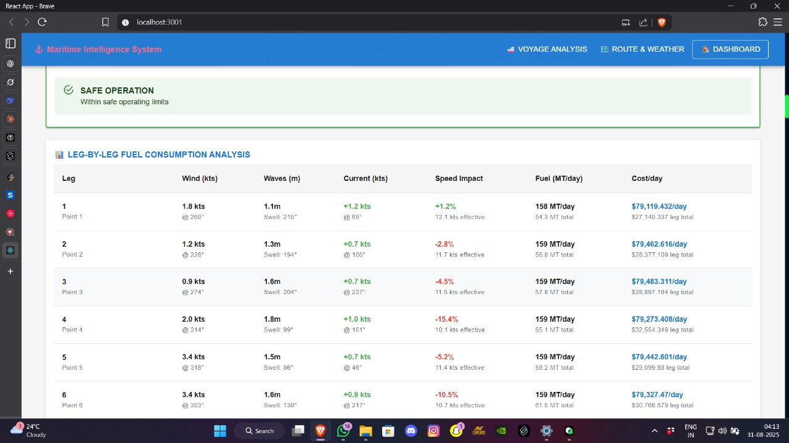
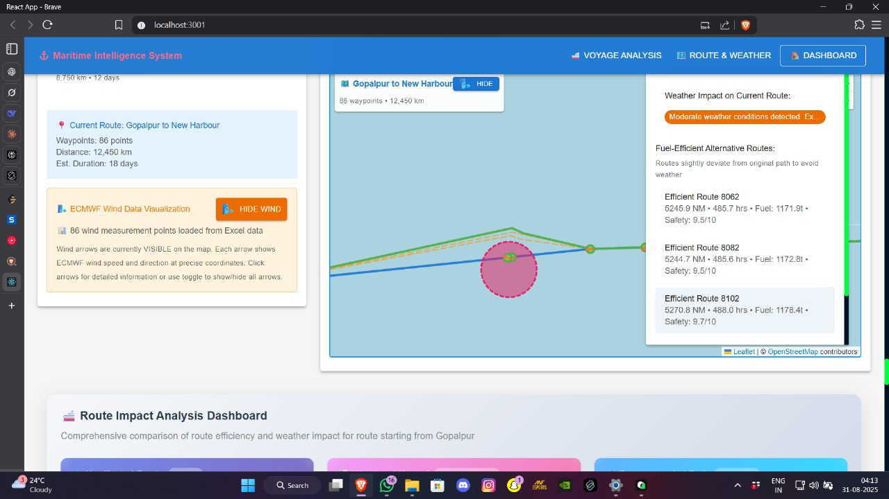
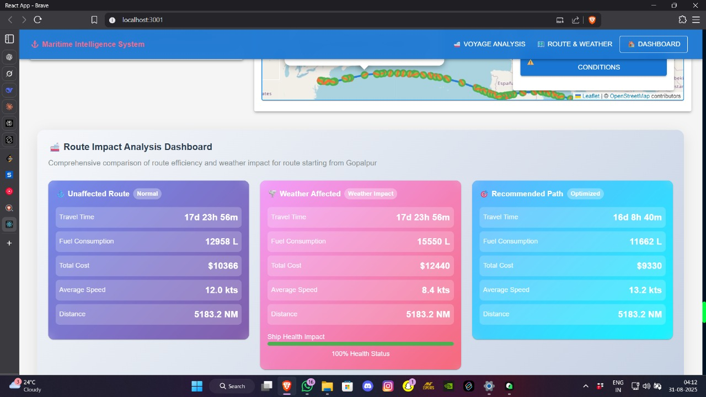
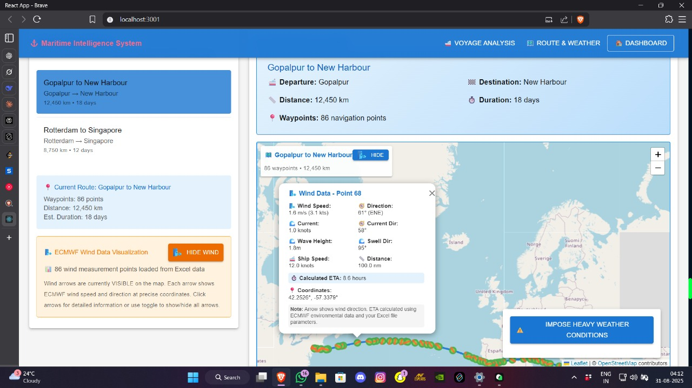

# Maritime Weather Dashboard

This project is a **Maritime Weather Dashboard** built with **React**. It visualizes maritime routes, weather conditions, and oceanographic data in a clear and interactive way. The project integrates advanced weather modeling for maritime navigation using a **Triangular Cubic Octahedral (TCO) Grid** system.

---

## Model Overview

### Triangular Cubic Octahedral (TCO) Grid Model
- A high-resolution grid system used for **weather and ocean forecasting**.  
- Provides accurate interpolation of wind, wave, and current data along maritime routes.  
- Supports 3D visualization of atmospheric and oceanographic phenomena.  
- Optimized for maritime navigation simulations and route planning.

This model ensures that the dashboard can **predict voyage time, vessel speed variations, and potential weather hazards** accurately along any given maritime path.

---

## Available Scripts

In the project directory, you can run:

### `npm start`
Runs the app in development mode.  
Open [http://localhost:3000](http://localhost:3000) to view it in your browser.  
The page will reload if you make edits.  
You will also see any lint errors in the console.

### `npm test`
Launches the test runner in interactive watch mode.  
See the [running tests documentation](https://facebook.github.io/create-react-app/docs/running-tests) for more information.

### `npm run build`
Builds the app for production into the `build` folder.  
It bundles React in production mode and optimizes the build for best performance.  
The build is minified and filenames include hashes.

### `npm run eject`
**Note: this is a one-way operation.** Once you eject, you cannot go back.  
Ejecting copies all configuration files and dependencies (webpack, Babel, ESLint, etc.) into your project for full control. All other commands still work but point to the copied scripts.

---

## Learn More

- [Create React App Documentation](https://facebook.github.io/create-react-app/docs/getting-started)  
- [React Documentation](https://reactjs.org/)  

---

## Features

- Interactive maritime route visualization using **Leaflet**.  
- Overlay of weather data: wind direction, wave height, and ocean currents.  
- Voyage speed and time prediction based on environmental conditions.  
- Advanced **TCO Grid Model** integration for accurate 3D weather and ocean data.  
- Easily extensible for additional maritime data or forecasting models.

---

## Project Screenshots

  
  
  
  
  

---

## System Requirements

- Node.js >= 14 < 23  
- NPM >= 6  
- GPU recommended for local rendering of advanced 3D weather simulations

---

## ⚠️ Deployment Note

Due to differences in GPU availability and configuration on cloud platforms, this project **may fail to deploy properly on certain servers**. However, it works flawlessly on local machines with compatible GPU and Node.js environment.  
We recommend running the project locally using `npm start` to fully experience the features.
